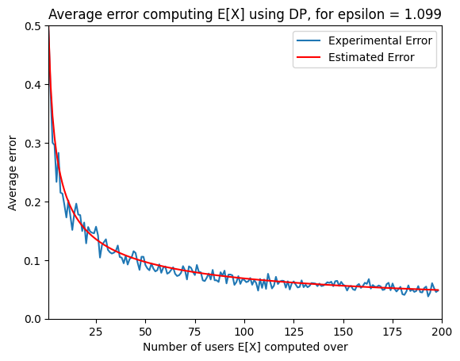

# Differentially Private Health Tokens (DPHT)

## Paper
The latest DPHT paper can be found at [DPHT.pdf](DPHT.pdf). The authors welcome feedback and may be contacted by email using the details in the paper or by clicking the following [link](mailto:dbutler@turing.ac.uk;chicks@turing.ac.uk;jbell@turing.ac.uk;cm@warwick.ac.uk;jon.crowcroft@cl.cam.ac.uk?subject=[DPHT]).


## Proof of concept implementation

This repository includes a simple reference implementation (in Python3), and proof-of-concept, of the DPHT proposal. In particular, we currently demonstrate the feasibility of our health tokens and evaluate the error introduced by differential privacy for different values of epsilon. To generate an example health token run [Generate_QR_Token.py](Generate_QR_Token.py), to verify run [Verify_QR_Token.py](Verify_QR_Token.py). Credentials, which can be displayed as standard QR codes, are signed using ECDSA over brainpoolP512r1 and comprise a randomised user token. Credentials are completely self-contained and can be verified offline, without interacting with the signer. Revocation is based on distributing revoked CIDs to verifiers.

- Example credential comprising a random user health token and a valid 512-bit ECDSA signature:

<center>

</center>
<br>

- Example simulation for a range of 1 to 200 users, iterated 50 times:

<center>

</center>
<br>


## Running the code

The requirements.txt file contains all dependencies. To run the implementation you can use the following commands.

```
virtualenv venv
source venv/bin/activate
pip install -r requirements.txt
python3 Generate_QR_Token.py
python3 Verify_QR_Token.py
```
